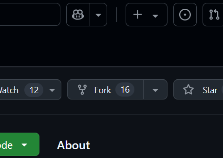

Editing STARDIS
===============

Now that you have installed STARDIS and hopefully set up everything you
need, you can now get started on **your first Pull Request**, which is
how you edit STARDIS!

Before You Edit
---------------

Before you can start contributing to STARDIS, you’ll need to download
and install it up on your computer. if you haven’t already, go through
the `Downloading and Installing STARDIS <../installation.rst>`__
documentation, and make sure to follow the `For
Developers <../installation.rst#for-developers>`__ section when you do
so.

You’ll also need a set up a `Github
account <https://github.com/signup?>`__. Github is a platform that lets
you easily access, download, and make edits to online ‘repositories’
(shared projects) using something called ‘Git’. Git is a version control
system that allows for developers easily keep prior versions of code,
work on features without breaking the main program, and collaborate with
others.

Creating a Fork
~~~~~~~~~~~~~~~

“Forking” a repository means creating a personal copy of a project so
you can make edits to it. Later, these edits can be applied to the
original project through a Pull Request, often shortened to “PR”. The
instructions here are will guide you through setting up STARDIS, but you
can find more general instruction
`here <https://docs.github.com/en/pull-requests/collaborating-with-pull-requests/working-with-forks/fork-a-repo>`__
if you need extra help.

1) Go to the `STARDIS Github
   page <https://github.com/tardis-sn/stardis>`__.

2) click **Fork**, which should be near the top right of the page.

1) By default, your account should be the Owner of this fork and “Copy
   the ``main`` brach only” should be selected. **click ‘Create fork’**.

Starting Your Environment
~~~~~~~~~~~~~~~~~~~~~~~~~

1) Launch your Command Line terminal, and navigatae to your Stardis
   direcotry using ``cd <path/to/Stardis/directory>``.

   -  Your ``<path/to/Stardis/directory>`` will be based on where you
      first downloaded Stardis to. You can find this using
      ``realpath Stardis``.

2) Start your **Stardis Environment** by running the command
   ``conda activate Stardis``

Branches
~~~~~~~~

One of the main reasons we use Git is because of Git **Branches**.
Branches are like off-shoots of main code, where you can make changes to
a specific feature or file without immediately worrying about the
broader implications of your changes. The main code is in a branch
called ``main``, and can be referred to as the *trunk*, because the
other branches come off of it.

Its important to keep in mind that when you want to start working on a
new feature or change, **make a new branch for that change!** This is
proper procedure for a variety of reasons, like making it easier to find
the source of bugs/error and making the process of adding features
smoother.

-  Make a new Branch with the command: ``git branch my_branch_name``

-  Change to your new branch with the command:
   ``git checkout my_branch_name``

-  To do both at once, use: ``git checkout -b my_branch_name``

It is good to name your branch after what you are changing in it. For
example, the branch name used to make this documentation was
``contribution_docs``, so an example from above would look like
``git checkout -b contribution_docs``. Make sure to change to the
``main`` branch before making a new branch, that way you will have a
fresh start to make your changes.

Lastly, if you need a reminder on what branches you have made, you can
use the command ``git branch`` to see a list.

While You Edit
--------------

While you are clicking through directories, making changes to your
heart’s desire, there are some things to note.

-  The edits you make will only impact the version on STARDIS on your
   computer for now, so you don’t have to worry about breaking anything.

-  After editing a file, make sure to save your changes! Only saved
   changes will be included in your pull request.

-  you can use the command ``git status`` to remind yourself what branch
   you are on and see what edits/additions you have made. Do this often!

Apply Your Changes
------------------

Now that you have made your change, you can finally make a pull request!
A pull request is essentially just a suggested change you think should
be made to the functional code base of STARDIS. Once accepted, your work
will be included in the version of STARDIS that everyone will use.

Don’t be Scared!
~~~~~~~~~~~~~~~~

You may be worried that your code doesn’t work, your changes don’t make
sense, or that for some reason what you did is not good enough. **This
is not the case, we promise!** A pull request can’t break anything. If
you did make any mistakes, then a pull request is how you can get
suggestions and help. It never hurts to make a pull request, and changes
can always be revised and edited, even after the initial request.

If you are still concerned a PR isn’t fully functional, you can always
mark a pull request as a draft. To do this, go to the Github website,
and find the new PR under either your account or on the STARDIS page.
Open the pull request, and on the right side of the screen you should
see an option to ‘convert to draft’.

Make a Pull Request
~~~~~~~~~~~~~~~~~~~

Here are the steps you can take to make your first PR:

1) Run the command ``git add -A``. If you only want to push some of your
   edits, replace ``-A`` with the paths to your edited files.

2) Run the command ``git commit -m '<explanation_of_your_pr>'``

   -  example: git commit -m ‘Typo fix in the quickstart notebook’

3) Run the command ``git push origin <my_branch_name>``

   -  example: git push origin contribution_docs

By doing this, the change you made will be pushed to your fork of
STARDIS under your Github account. Next, you need to go to `the original
STARDIS repository <https://github.com/tardis-sn/stardis>`__ where you
made your clone. There will be a yellow banner asking you to **Compare &
Pull Request**.

You will then need to fill out a form that goes with the PR where you
explain your changes. Make sure to be specific in your explanation of
the changes, as well as edit the ‘type’ field to indicate what your
changes effect.

Revising and Editing your Pull Request
--------------------------------------

The vast majority of pull requests aren’t perfect on their first
iteration, even those from expert programmers! After you make your pull
request it will be up to STARDIS reviewers to give it a look over and
see what is good and what needs a little polish. **Don’t be discouraged
by this, its part of the process!** On Github you see the comments and
suggestions of the STARDIS reviewers, and after some iterations, your
code can get ‘merged’, or added to STARDIS!

Here are some things to keep in mind when going to revise and edit your
pull requests:

-  You will need to go back to the branch you made the pull request from
   to revise it. Go through making changes to this branch just as you
   did before making the request.

-  When you want to have your new changes made to your pull request, all
   you need to do is ``add``, ``commit``, and ``push`` commands again
   jsut as you did earlier. Your new message in your ``commit`` command
   should elaborate on what you updated, edited, or added to the
   request.

-  No need to go to Github and Push or Pull any changes. Because you
   already made the pull request, it will automatically update after you
   run the new commit command.
