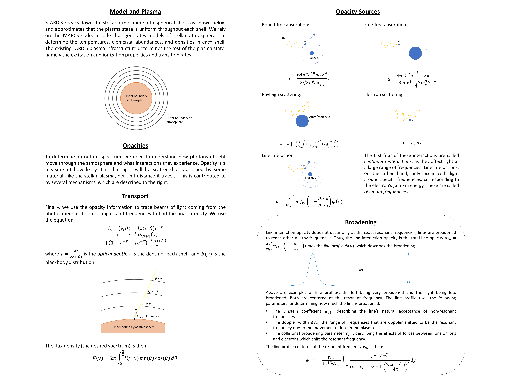

# STARDIS

## Installation

### Setting Up the Environment

> **_NOTE:_** 
> - STARDIS is only supported on macOS and GNU/Linux. Windows users can run STARDIS from [WSL](https://docs.microsoft.com/en-us/windows/wsl/) or a Virtual Machine.
> - STARDIS packages and dependencies are distributed only through the [conda](https://docs.conda.io/en/latest/) package management system, therefore installation requires [Anaconda](https://docs.anaconda.com/anaconda/install/index.html) or [Miniconda](https://conda.io/projects/conda/en/latest/user-guide/install/index.html) to be installed on your system.

STARDIS uses exclusively the packages in the TARDIS enviroment, as well as using the TARDIS code itself. However, since STARDIS can be sensitive to changes in TARDIS, we strongly suggest that users create a separate environment for STARDIS that pins the TARDIS version. To do this, run the following in the terminal (replacing `{platform}` with either `linux` or `osx` as applicable):

```
$ wget -q https://github.com/tardis-sn/tardis/releases/latest/download/conda-{platform}-64.lock
$ conda create --name stardis --file conda-{platform}-64.lock
$ conda activate stardis
$ pip install git+https://github.com/tardis-sn/tardis.git@release-2023.04.16
```

The third command (`conda activate stardis`) activates the environment, which is necessary to install the pinned version of TARDIS to your STARDIS environment.

### Downloading STARDIS

STARDIS can be downloaded by **non-developers** by running `$ pip install git+https://github.com/tardis-sn/stardis.git@main` in the terminal while in your STARDIS environment.

**Developers** must instead clone and fork the STARDIS repository. First, [fork the repository](https://github.com/tardis-sn/stardis/fork) and [configure GitHub to work with SSH keys](https://docs.github.com/en/authentication/connecting-to-github-with-ssh), and then run the following in the terminal:

```
$ git clone git@github.com:<username>/stardis.git
$ cd stardis
$ git remote add upstream git@github.com:tardis-sn/stardis.git
$ git fetch upstream
$ git checkout upstream/main
$ python setup.py develop
```

## Running the Code

### The `run_stardis()` Function

In the repository, `docs/quickstart.ipynb` has a basic notebook that runs STARDIS and plots a spectrum. The main function, `run_stardis()`, requires as its first argument the name of a configuration file, which will be described below. The second argument is an array of the frequencies or wavelengths for which you are requesting the flux density, times an appropriate astropy quantity (such as Hertz or Angstroms). Note that this must be an array times a quantity, **not** an array of astropy quantities. 

### The STARDIS Configuration

STARDIS uses [YAML](https://yaml.org/) files for the configuration. The [quickstart notebook](quickstart.ipynb) uses an [example configuration](stardis_example.yml) called `stardis_example.yml`. Below, we present an example for instructions for customizing the configuration for your needs.

```yaml
stardis_config_version: 1.0
atom_data: <filepath to atomic data file>
model:
    type: marcs # more options will be available in the future
    fname: <filepath to MARCS model file>
    final_atomic_number: <atomic number of largest element considered> # may be up to 30
opacity:
    file: # reads a bound-free or free-free opacity file, omit if none
        <species1>_<either bf for bound-free or ff for free-free>: <filepath to opacity file>
        <species2>_<either bf for bound-free or ff for free-free>: <filepath to opacity file>
        ...
    bf: # uses the hydrogenic approximation for bound-free opacity, omit if none
        <species1>: {} # there will eventually be options to include files with gaunt factors or departure coefficients
        <species2>: {}
        ...
    ff: # uses the hydrogenic approximation for free-free opacity, omit if none
        <species1>: {} # there will eventually be options to include files with gaunt factors or departure coefficients
        <species2>: {}
        ...
    rayleigh: <list of species considered for rayleigh scattering> # may include H, He, and/or H2, omit or use [] for none
    disable_electron_scattering: <True or False>
    line: # settings for line interaction opacity, at least one subfield is required
        disable: <True or False>
        broadening: <list of non-thermal broadening sources considered> # may include radiation, linear_stark, quadratic_stark, and/or van_der_waals, omit or use [] for none
        min: <minimum resonance frequency or wavelength of lines considered> # must have units, such as Hz or AA
        max: <maximum resonance frequency or wavelength of lines considered> # must have units, such as Hz or AA
        broadening_range: <maximum distance in frquency space to the resonant frequency for line broadening to be considered> # necessary for computational efficiency and must have units, 1e13 Hz recommended
no_of_thetas: <number of angles to sample for raytracing>
```

In fields where an atomic species is requested, the species must be in the form `<atomic symbol>_<ionization roman numeral>`. For example, `H_I` for neutral hydrogen, or `Si_III` for twice-ionized silicon.

Additionally, in the opacity file section, the following entries are valid:
- `Hminus_bf`
- `Hminus_ff`
- `Heminus_ff`
- `H2minus_ff`
- `H2plus_ff`

### Opacity File Format

STARDIS can read and interpolate continuum opacity cross-section files for bound-free or free-free absorption (technically, for free-free absorption the files would provide the cross-section per electron density). The files must be one of the following formats:

```csv
wavelength_1, cross-section_1
wavelength_2, cross-section_2
wavelength_3, cross-section_3
...
```

or

```csv
, temperature_1, temperature_2, temperature_3, ...
wavelength_1, cross-section_11, cross-section_12, cross-section_13, ...
wavelength_2, cross-section_21, cross-section_22, cross-section_23, ...
wavelength_3, cross-section_31, cross-section_32, cross-section_33, ...
...
```

Note the leading comma in the latter format. Temperatures must be in Kelvin, wavelengths in Angstroms, and cross-sections in cm^2 for bound-free or cm^5 for free-free (once again because free-free opacity files provide the cross-section per electron density).

## The Physics of STARDIS

The following is an excerpt from a poster presentation on STARDIS:



## References

See [stardis.bib](stardis.bib).
